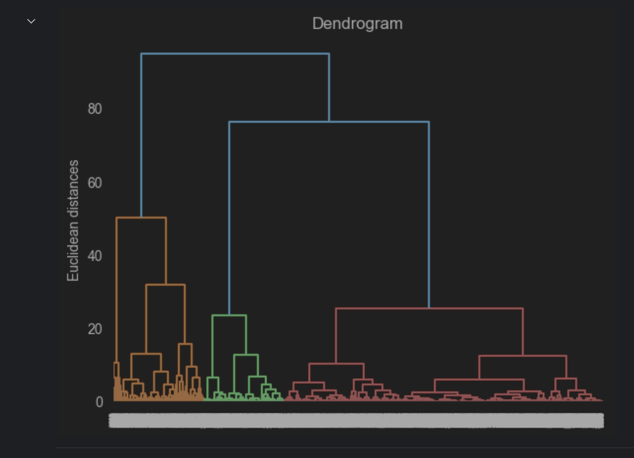
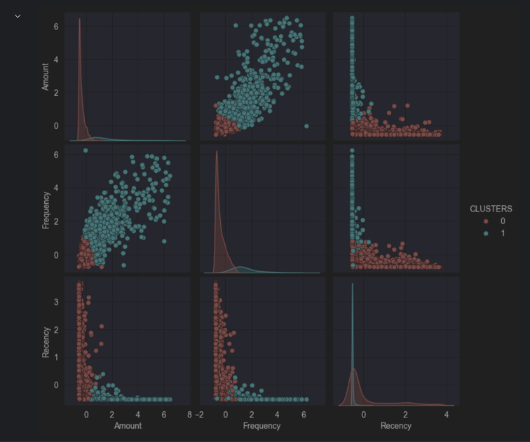

# Product Segmentation with Hierarchical Clustering

## Problem Statement
An online retailer needs actionable segmentation of its product catalogue to improve marketing efficiency, inventory turnover, and cash-flow planning. Using engineered sales features, the goal is to discover product groups with distinct purchasing patterns and translate those into clear commercial actions (discounting, campaign prioritisation, and stocking decisions).

## Dataset
The data represents transactions captured between 2010–2011 for a UK gift wholesaler. From the raw transactional fields (StockCode, Quantity, UnitPrice, InvoiceDate), three continuous product-level features were engineered:

- **Amount** — Total revenue contribution per product over the period.  
- **Frequency** — Number of distinct purchase events per product over the period.  
- **Recency** — Days since a product was last purchased (lower = more recent).

> File: `data/EngineeredRetail.csv`

These features provide a compact RFM-style view suitable for unsupervised segmentation.

-----------
## Approach

### 1) Data Preparation
- Load engineered product features and perform basic validation.
- Remove/inspect any structurally invalid rows; handle extreme outliers as needed.
- **Scale** continuous variables (e.g., StandardScaler) before distance-based clustering to prevent a single feature dominating distances.

### 2) Clustering Method
- **Algorithm:** Hierarchical agglomerative clustering (HAC).  
- **Distance metric:** Euclidean (on standardised features).  
- **Linkage:** Ward (minimises within-cluster variance and pairs naturally with Euclidean distance).  
  - Alternative linkages (average/complete) may be inspected for sensitivity analysis, but Ward+Euclidean is typically best for compact, well-separated clusters on scaled data.

### 3) Model Selection & Validation
- Inspect **dendrogram** to locate natural cut heights.
- Compare candidate solutions (**k = 2** and **k = 3**) using:
  - **Silhouette score** (separation vs cohesion) on the standardised space.
  - **Cluster size balance**, interpretability in business terms.
  - **Pairwise plots** (Amount vs Recency, Amount vs Frequency) for face-valid patterns.

------
### Dendrogram [process and insights below]

### Data Plot 

## Analysis

### Behavioural Structure from Pairwise Plots
Using pairwise scatterplots and diagonal KDEs for **Amount**, **Frequency**, and **Recency**, three intuitive clusters emerge (colors referenced from the analysis visuals):

- **Cluster 0 (Red): High Amount, High Frequency, Lower Recency**  
  Products with strong revenue and frequent purchases that have sold recently. These are proven performers with fast turnover and sustained demand.

- **Cluster 1 (Green): Moderate Amount, Moderate Frequency, Moderate Recency**  
  A broad middle segment with steady contribution and room for growth. These items respond to targeted marketing that nudges them into the top-performing tier.

- **Cluster 2 (Blue): Low Amount, Low Frequency, High Recency**  
  Slow movers that have not sold recently and contribute less to revenue. Inventory risk is higher; consider clearance strategies.

### Commercial Recommendations

**Bulk Discounts / Inventory Actions**
- Prioritise **Cluster 2 (Blue)** for bulk discounts or clearance promotions (e.g., “buy one, get one”), to stimulate demand and free up working capital.
- Consider selective bulk incentives for **Cluster 1 (Green)** to accelerate velocity where margins allow.

**Aggressive Marketing Focus**
- Focus aggressive marketing on **Cluster 1 (Green)**—these products are already moving but have untapped upside. Targeted campaigns can shift them toward Cluster 0 behaviour.
- **Cluster 0 (Red)** requires maintenance marketing only; protect share and avoid unnecessary discount erosion.

**Finance & Cash-Flow (Turnover via Amount vs Recency)**
- **Cluster 0 (Red):** Low recency and high amount imply fast turnover and meaningful revenue contribution. Keep these well-stocked to preserve cash-generating flow.  
- **Cluster 1 (Green):** Moderate recency and amount suggest steady turnover. Monitor seasonality; keep stock proportional to recent trends to avoid over-capitalising inventory.  
- **Cluster 2 (Blue):** High recency and low amount point to slow turnover. Reduce exposure (order less, discount to clear) to release tied-up cash.

## Two vs Three Clusters — Recommendation
Both 2- and 3-cluster solutions were evaluated.  
- **2 clusters** simplify the story into **High-turnover vs Low-turnover** products with visibly reduced overlap in frequency distributions—very manager-friendly for quick action.  
- **3 clusters** add a **middle segment** (the “develop” bucket) that is operationally useful for differentiated marketing and nuanced inventory planning.

**Recommendation:**  
- If the primary goal is *organisational clarity and rapid execution*, use **2 clusters** (high vs low turnover).  
- If the goal is *targeted optimisation*, retain **3 clusters** to explicitly manage the “develop” segment (Cluster 1) with uplift campaigns and selective incentives.

Given the analysis emphasis on practical execution and observed separation, a **2-cluster model** is justified for streamlined decision-making; the **3-cluster** view remains valuable for marketing granularity.

## Why Hierarchical Clustering
- **Interpretability:** The dendrogram offers a transparent view of cluster formation and cut-off choices.  
- **No need to pre-specify k initially:** You can inspect merges and then decide on a cut height.  
- **Ward linkage:** Tends to produce compact, variance-minimising clusters aligned with business intuition (core performers vs fringe).  

-----------

## Limitations & Risk Controls
- **Scale sensitivity:** Always standardise features before distance-based HAC.  
- **Outliers:** Extreme values can distort distances and merge order; detect and treat outliers or use robust scalers where appropriate.  
- **Temporal drift:** Segments based on 2010–2011 behaviour can shift; re-fit periodically and monitor stability.  
- **Feature scope:** Amount/Frequency/Recency capture demand dynamics but ignore margins, cannibalisation, and substitution effects—integrate these for fuller commercial decisions.
